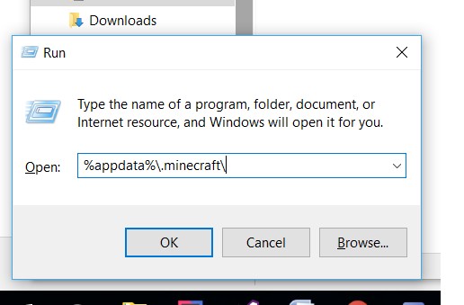

# SMCReboot

### Minecraft 1.10.2 - Alpha Test Pack

**This pack is meant for private testing and usage.** 

For actual verified mods, go to https://mods.curse.com/mc-mods/minecraft for valid sources.

#Install Instructions - In case if Twitch Launcher fails on you

1. Install [JavaJDK](http://www.oracle.com/technetwork/java/javase/downloads/jdk8-downloads-2133151.html) that suits the version of OS that you are using. (Skip if you have done so)

2. Go to [Forge](https://files.minecraftforge.net/maven/net/minecraftforge/forge/index_1.10.2.html) and download **Version: 12.18.3.2316 - this is the version that we are using for the server.**
	
	> 1. Download the following:
	>	*For Windows: Installer-win.exe
	>	*For Mac/Linux: Universal
	> 2. Click on your .exe/.jar file to install forge
	>	*Select install client
	>	*Now open your regular Minecraft Launcher and check if "1.10.2 forge1.10.2-12.18.3...blah blah blah" as an option. If so, continue on with the instructions. If not, consult [Google](https://www.google.com/search?rlz=1C1CHBF_enUS697US697&q=how+to+install+minecraft+forge&oq=how+to+install+minecraft+forge&gs_l=psy-ab.3..0i67k1j0i20k1j0l2.8553.8553.0.8806.1.1.0.0.0.0.96.96.1.1.0....0...1.1.64.psy-ab..0.1.96.5c2j8N2P_Fs).

3. Download the contents in the /src folder.
	> **For ALL USERS**
	> Download the *.zip file and unzip the contents. You only care about whats in /src folder.
	> 
	> Drag both mods and config into the following location
	> **NOTE: This may differ depending on how you tweaked your computer.**	
		
		> For Windows: Windows + R then type in: "%appdata%\.minecraft\"
			
	
		
		> For MAC/Linux: Search the location: "~/Library/Application Support/minecraft"
			
	

4. Now run your game. **Have fun!**

